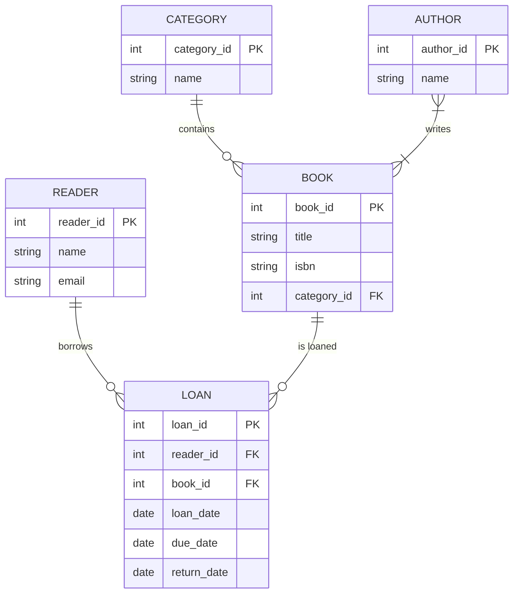

# ER-модель — Library Management System

```mermaid
erDiagram
    READER {
        int reader_id PK
        string name
        string email
    }

    BOOK {
        int book_id PK
        string title
        string isbn
        int category_id FK
    }

    AUTHOR {
        int author_id PK
        string name
    }

    CATEGORY {
        int category_id PK
        string name
    }

    LOAN {
        int loan_id PK
        int reader_id FK
        int book_id FK
        date loan_date
        date due_date
        date return_date
    }

    READER ||--o{ LOAN : borrows
    BOOK ||--o{ LOAN : "is loaned"
    CATEGORY ||--o{ BOOK : contains
    AUTHOR }|--|{ BOOK : writes
```
